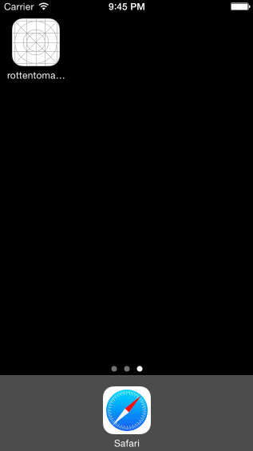

# RottenTomatoes Box Office Demo

This is a simple Rotten Tomatoes app that has two tabs, one for movies in the theater and one for top dvd rentals

Time spent: 15 hours spent in total

Completed user stories:

 * [x] Required: User can view a list of latest box office movies including title, cast and tomatoes rating
 * [x] Required: User can click on a movie in the list to bring up a details page with additional information such as synopsis
 * [x] Optional: Placeholder image is used for movie posters loaded in from the network

 * [x] Required: User can view a list of movies from Rotten Tomatoes.  Poster images must be loading asynchronously.
 * [x] Required: User can view movie details by tapping on a cell
 * [x] Required: User sees loading state while waiting for movies API.  You can use one of the 3rd party libraries here.
 * [x] Required: User sees error message when there's a networking error.  You may not use UIAlertView to display the error.  See this screenshot for what the error message should look like: network error screenshot.
 * [x] Required: User can pull to refresh the movie list.
 * [x] Optional: All images fade in (optional)
 * [x] Optional: Customize the navigation bar. (optional)
 * [x] Optional: Add a tab bar for Box Office and DVD. (optional)
 * [] Optional: All images should be cached in memory and disk. In other words, images load immediately upon cold start (optional).
Customize the highlight and selection effect of the cell. - Actually, I enabled support for this, however, because I'm not caching the URL to disk, my AFNetworking call fails when there is no network and therefore this doesn't really work.
 
Notes:

I spent a bit of time hacking with not a lot of time to make things look nice. My LiceCap gif doesn't really show that the images fade in nicely. 

Walkthrough of all user stories:

GIF created with [LiceCap](http://www.cockos.com/licecap/).
